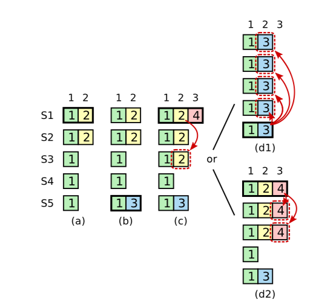

在raft的论文的6.3和6.4节描述了raft如何实现线性一致性语义。下面总结一下dragonboat的实现方式，供以后参考。

# 需要考虑的问题

* 客户端发起请求，如果请求在commited之后，apply之前，系统挂了，客户端没有收到响应，又重新发起了一笔同样的请求，会发生什么问题。
* 客户端可能向A节点发起了写请求，写成功了，然后突然A挂了，客户端又去B节点发起读请求，那么B节点能正确返回A节点写入的值吗？ 

# 理论

1. 在线性语义下，在调用和相应的整个过程中，只能让客户端的请求执行一次，所以，要为每个客户端建立一个session的概念。session维护了一个唯一的标识符用于标识客户端来源，同时要提供一个单调递增的数字用于标识当前客户端的第N此请求，如果session中已经处理了N请求，那么不会再影响N-1以前的请求。实现了指令去重的功能。（这里还有一个session失效的问题，后续再描述）

2.  针对第二个问题，其实只需要让读请求也走一遍raft日志，entry的命令里存储的就是get命令，那么肯定是可以保证线性一致性的。但是因为每次都会有一个log落盘的开销，对于大量的请求来说不太合适。所以论文提出了ReadIndex协议。描述如下：

   * 客户端发起一笔读请求（需要维护在session中，标识本次请求的标识符）
   * 因为接受客户端请求的节点，不一定是leader的，所以节点要判断自己是不是leader，如果不是leader，递转请求到leader。
   * leader节点把收到get请求消息的时候，记录下当前commited的index， 记录为ReadIndex。简单来说，就是要知道当前get请求到达的时候，raft组当前处理到了哪个地方。get请求要获取这个readIndex之后的数据
   * leader把这个readIndex返回给请求方节点
   * 请求方需要等到自己本地的apply index >=ReadIndex的时候，才可以返回给客户端。因为只有apply之后，这个节点的数据才能和leader的数据一致。 

   总结一下，大致原理，就是客户端请求的时候，leader已经执行到了N号日志，而其他服务节点，才执行到N-100，那么如果要从其他节点获取到get请求的一致的结果，那么必须得等到自己也到了N号的时候，数据才会一致。

# ReadIndex的具体细节

看似readIndex协议很简单，但是有很多需要注意的细节。

* 假设客户端的get请求，直接发到了leader节点，leader节点是不是可以直接把数据发给客户端？ 答案是不可以。因为假设ABCDE五个节点构成了一个raft组，其中AB在北京，CDE在武汉，当前A是leader，租期是10分钟。 在某个时候，北京和武汉的光纤被挖断了，那么AB和CDE出现了网络分区，CDE自己选了一个leader出来，然后开始处理请求，commitedIndex一直向前推动，但是A节点不这么认为，他还认为自己是leader，认为自己的数据一定是最新的，那么如果在这个时候A节点接受了客户端的请求，把A节点的数据返回给了客户端，那么客户端其实读取到的就是stale过期的数据。

  为了解决这个问题，首选要保证： **leader节点确实是真的leader。 只需要向所有的机器发送一个心跳，如果收到了大多数的回应，就能确定当前leader没有被分区，还是leader**。

* 如果leader刚刚当选，就收到了客户端的get请求，即便发送了心跳确定了leader的地位，那么是不是可以直接把数据返回给客户端呢？ 也不能。下面来分析这个情况。 

  

  看这种情况（黑色的框标识leader，方框里的字表示term，横向的方框下标表示索引），用一个**[T,I]**来表示当前Term为T，index为I的数据。

  * 在a阶段，S1是leader，在term为2的时候发起了index为2的日志，复制了1台之后S1挂了，日志记录为[2,2]
  * 在b阶段，S5接受了S3，S4的选票，当选为leader，当前term为3，他也写了一笔index为2的日志到自己的节点，日志记录为[3,2]
  * 在c阶段，S5挂了，他写的term3，index2的日志别人还不知道。S1又当选为leader，term为4

  

  好，现在开始分析这种情况，如果S1在c阶段，刚刚当选leader，此时，客户端发来了一个get请求，S1发送了一笔心跳之后，发现自己确实是leader。但是，**此时还不能直接返回数据**，因为假设把[2,2]的数据返回给了客户端，然后突然S1挂了，怎么办。这个时候S5可能会重现当选为leader（因为他的term最大），S5就会把[3,2]的数据复制到其他节点，覆盖了[2,2]。其他的读请求读取到的是[3,2]的数据，而刚才的客户端请求读取的是[2,2]的数据，就不会是线性一致的了。 

  针对上述情况，需要做一个保证：

  > leader在收到get请求的时候，第一步要做的就是： 检查当前leader的term下是不是已经commited过日志了。

  如果commited过了日志，那么即使S1挂了，S5也不会当选为leader，因为他的term是3，其他节点有记录为term4了。所以此时的S1的数据就是安全的，也就可以安全的返回给调用方了。

  这也就要求：

  > leader在当选之后，首先要确认leader的地位：即发送一条NO-OP的日志给其他节点，等收到大多数的回应之后，leader地位才会真正的确立。

* 如果每一个get请求，都要发送一个心跳，那么效率就会很低。所以可以做一个优化，在一个心跳周期内，持续累计ReadIndex请求，当心跳结束之后确定了leader的地址，就可以给N个ReadIndex请求返回数据了。


总结一下ReadIndex的步骤：

1. 如果leader在当前任期内没有commit过日志，就一直等到有日志提交之后，才能进行后续步骤
2. leader节点记录下当前请求进来时的commit index 做为ReadIndex
3. leader必须确保他的地位没有被压制，也就是要发送一个心跳，收到大多数的回应之后才能确定leader地位
4. leader等待他的状态机apply到ReadIndex之后，才能保证线性一致性
5. leader执行get请求，把数据返回给调用方


其中1，2，3步骤必须发生在leader节点，而4，5步骤可以发生在其他服务器节点。（状态机都执行到了readIndex的时候，数据是一致的）


# dragonboat实现代码

## 发起方发起请求

客户端发起读请求：

```go
	result, err := nh.SyncRead(ctx, exampleClusterID, []byte{})
```

调用`SyncRead`方法，该方法直接调用了线性读取，代码如下：

```go
func (nh *NodeHost) SyncRead(ctx context.Context, clusterID uint64,
	query interface{}) (interface{}, error) {
  //ctx用于取消调用，clusterID表示一个raft组，用于区分多个组
  //func表示当readIndex消息执行成功之后，执行的回调函数，也就是去本地状态机中拿去数据，对应上述的4，5阶段。
	v, err := nh.linearizableRead(ctx, clusterID,
		func(node *node) (interface{}, error) {
			data, err := node.sm.Lookup(query)
			if err == rsm.ErrClusterClosed {
				return nil, ErrClusterClosed
			}
			return data, err
		})
	if err != nil {
		return nil, err
	}
	return v, nil
}
```


实现的主要过程在`lineariableRead`方法中，具体代码为：

```go
func (nh *NodeHost) linearizableRead(ctx context.Context,
	clusterID uint64,
	f func(n *node) (interface{}, error)) (interface{}, error) {
  //获取超时时间
	timeout, err := getTimeoutFromContext(ctx)
	if err != nil {
		return nil, err
	}
  //异步发起ReadIndex协议，返回一个ReadState结构体，描述了该笔请求对应的所有信息
	rs, node, err := nh.readIndex(clusterID, nil, timeout)
	if err != nil {
		return nil, err
	}
	select {
  //ReadState结构体中的CompletedC，是用来接收回复结果的channel
	case s := <-rs.CompletedC:
		if s.Timeout() {
      //超时
			return nil, ErrTimeout
		} else if s.Completed() {
      //如果请求完成了，channel会接收到信息，之后就可以安全的执行回调函数了
			rs.Release()
			return f(node)
		} else if s.Terminated() {
			return nil, ErrClusterClosed
		}
		panic("unknown completedc code")
	case <-ctx.Done():
    //主动取消请求
		if ctx.Err() == context.Canceled {
			return nil, ErrCanceled
		} else if ctx.Err() == context.DeadlineExceeded {
			return nil, ErrTimeout
		}
		panic("unknown ctx error")
	}
}
```


下面跟进一下`readIndex`方法：

```go
func (nh *NodeHost) readIndex(clusterID uint64,
	handler ICompleteHandler,
	timeout time.Duration) (*RequestState, *node, error) {
  //每一个clusterID，对应了一组raft，这里根据clusterID取出对应的Node结构体
	n, ok := nh.getClusterNotLocked(clusterID)
	if !ok {
		return nil, nil, ErrClusterNotFound
	}
  //发起readIndex请求。在dragonboat里，网络请求都是异步发送的，实现方式都是将请求加入到队列中。
	req, err := n.read(handler, timeout)
	if err != nil {
		return nil, nil, err
	}
  //通知监听者，队列中有消息了，可以去执行了。具体的实现见：execEngine.go中的`nodeWorkerMain`方法。
	nh.execEngine.setNodeReady(clusterID)
	return req, n, err
}
```


`readIndex`方法将请求调用了node.read方法，来看具体的实现

```go
func (n *node) read(handler ICompleteHandler,
	timeout time.Duration) (*RequestState, error) {
  //每一个node，都持有几个消息队列，其中一个是pendingReadIndexes，从名称上来看，是用来存取当前正在进行调用的，尚未结束的ReadIndex请求的信息
	rs, err := n.pendingReadIndexes.read(handler, timeout)
	if err == nil {
		rs.node = n
	}
	return rs, err
}
```


`pendingReadIndexes`的read方法代码为：

```go

func (p *pendingReadIndex) read(handler ICompleteHandler,
	timeout time.Duration) (*RequestState, error) {
  //获取超时时间
	timeoutTick := p.getTimeoutTick(timeout)
	if timeoutTick == 0 {
		return nil, ErrTimeoutTooSmall
	}
  //从对象池中获取一个RequestState对象，避免每次都去内存中申请，也是提高性能的一个办法
  //什么时候关闭呢？当消息成功回复了，或者超时了，失败了等，后续会归还这个对象。 
	req := p.pool.Get().(*RequestState)
  //设置请求的一些信息，例如回调函数
	req.completeHandler = handler
  //设置该笔请求的一个唯一标识key
	req.key = p.nextUserCtx()
  //设置deadline时间线，超过这个时间，就算超时
	req.deadline = p.getTick() + timeoutTick
	if len(req.CompletedC) > 0 {
    //消息被回复之后，会得到一些数据，这里用一个channel来接受。主要作用是等待消息。这里创建一个chanel，刚开始的
    //linearizable方法会持续等待这个channel的数据。 而另外有个接受消息的goroutinte会给这个channel赋值。
		req.CompletedC = make(chan RequestResult, 1)
	}
  //加入到请求队列中，等到发起真正的网络请求。
	ok, closed := p.requests.add(req)
	if closed {
		return nil, ErrClusterClosed
	}
	if !ok {
		return nil, ErrSystemBusy
	}
  //返回这个requestState指针，让调用方可以得到channel，来阻塞等待事件结束。
	return req, nil
}

```

至于这个队列中的信息，是如何发送的，后续会专门拿出一个文章来介绍。这里只要认为加入到队列中之后，消息就会被发送到对应的服务端。

## 服务端响应

后续会介绍网络接受模块，这里只需要知道`raft.go`是用来接收网络上的raft消息的入口即可。

```go
func (r *raft) initializeHandlerMap() {
	// candidate
	r.handlers[candidate][pb.Heartbeat] = r.handleCandidateHeartbeat
	r.handlers[candidate][pb.Propose] = r.handleCandidatePropose
	r.handlers[candidate][pb.Replicate] = r.handleCandidateReplicate
	r.handlers[candidate][pb.InstallSnapshot] = r.handleCandidateInstallSnapshot
	r.handlers[candidate][pb.RequestVoteResp] = r.handleCandidateRequestVoteResp
	r.handlers[candidate][pb.Election] = r.handleNodeElection
	r.handlers[candidate][pb.RequestVote] = r.handleNodeRequestVote
	r.handlers[candidate][pb.ConfigChangeEvent] = r.handleNodeConfigChange
	r.handlers[candidate][pb.LocalTick] = r.handleLocalTick
	r.handlers[candidate][pb.SnapshotReceived] = r.handleRestoreRemote
	// follower
	r.handlers[follower][pb.Propose] = r.handleFollowerPropose
	r.handlers[follower][pb.Replicate] = r.handleFollowerReplicate
	r.handlers[follower][pb.Heartbeat] = r.handleFollowerHeartbeat
	r.handlers[follower][pb.ReadIndex] = r.handleFollowerReadIndex
	r.handlers[follower][pb.LeaderTransfer] = r.handleFollowerLeaderTransfer
	r.handlers[follower][pb.ReadIndexResp] = r.handleFollowerReadIndexResp
	r.handlers[follower][pb.InstallSnapshot] = r.handleFollowerInstallSnapshot
	r.handlers[follower][pb.Election] = r.handleNodeElection
	r.handlers[follower][pb.RequestVote] = r.handleNodeRequestVote
	r.handlers[follower][pb.TimeoutNow] = r.handleFollowerTimeoutNow
	r.handlers[follower][pb.ConfigChangeEvent] = r.handleNodeConfigChange
	r.handlers[follower][pb.LocalTick] = r.handleLocalTick
	r.handlers[follower][pb.SnapshotReceived] = r.handleRestoreRemote
	// leader
	r.handlers[leader][pb.LeaderHeartbeat] = r.handleLeaderHeartbeat
	r.handlers[leader][pb.CheckQuorum] = r.handleLeaderCheckQuorum
	r.handlers[leader][pb.Propose] = r.handleLeaderPropose
	r.handlers[leader][pb.ReadIndex] = r.handleLeaderReadIndex
	r.handlers[leader][pb.ReplicateResp] = lw(r, r.handleLeaderReplicateResp)
	r.handlers[leader][pb.HeartbeatResp] = lw(r, r.handleLeaderHeartbeatResp)
	r.handlers[leader][pb.SnapshotStatus] = lw(r, r.handleLeaderSnapshotStatus)
	r.handlers[leader][pb.Unreachable] = lw(r, r.handleLeaderUnreachable)
	r.handlers[leader][pb.LeaderTransfer] = lw(r, r.handleLeaderTransfer)
	r.handlers[leader][pb.Election] = r.handleNodeElection
	r.handlers[leader][pb.RequestVote] = r.handleNodeRequestVote
	r.handlers[leader][pb.ConfigChangeEvent] = r.handleNodeConfigChange
	r.handlers[leader][pb.LocalTick] = r.handleLocalTick
	r.handlers[leader][pb.SnapshotReceived] = r.handleRestoreRemote
	r.handlers[leader][pb.RateLimit] = r.handleLeaderRateLimit
	// observer
	r.handlers[observer][pb.Heartbeat] = r.handleObserverHeartbeat
	r.handlers[observer][pb.Replicate] = r.handleObserverReplicate
	r.handlers[observer][pb.InstallSnapshot] = r.handleObserverSnapshot
	r.handlers[observer][pb.Propose] = r.handleObserverPropose
	r.handlers[observer][pb.ReadIndex] = r.handleObserverReadIndex
	r.handlers[observer][pb.ReadIndexResp] = r.handleObserverReadIndexResp
	r.handlers[observer][pb.ConfigChangeEvent] = r.handleNodeConfigChange
	r.handlers[observer][pb.LocalTick] = r.handleLocalTick
	r.handlers[observer][pb.SnapshotReceived] = r.handleRestoreRemote
}
```

不同的节点状态，针对不同的消息类型，有不同的处理函数。

重点关注一下`follower` 和`leader` ，对于`ReadIndex`的处理方式。

* follower

  接收到请求之后，触发`handleFollowerReadIndex`方法

  ```
   func (r *raft) handleFollowerReadIndex(m pb.Message) {
     if r.leaderID == NoLeader {
       plog.Warningf("%s dropped ReadIndex as no leader", r.describe())
       return
     }
     //直接递转给leader
     m.To = r.leaderID
     r.send(m)
   }
  ```

* leader

  leader端接收到readIndex，执行`handleLeaderReadIndex` 方法

  ```go
  //在论文的6.4节有描述具体的信息
  func (r *raft) handleLeaderReadIndex(m pb.Message) {
  	if r.selfRemoved() {
  		plog.Warningf("dropping a read index request, local node removed")
  		return
  	}
    //从消息中反序列化出本次请求的唯一ID，也就是ctx
  	ctx := pb.SystemCtx{
  		High: m.HintHigh,
  		Low:  m.Hint,
  	}
    //这里分集群的和单机的情况，单机的情况下没有什么leader不leader的，因为只有一个节点，直接返回数据就可以了
    
    //处理多节点部署的情况
  	if !r.isSingleNodeQuorum() {
      //按照上述描述的情景，leader节点首先要判断当前是否在任期内有过一笔提交，因为有了commited的，才能确保leader的地位，这里非常关键。
  		if !r.hasCommittedEntryAtCurrentTerm() {
  			// leader doesn't know the commit value of the cluster
  			// see raft thesis section 6.4, this is the first step of the ReadIndex
  			// protocol.
  			plog.Warningf("ReadIndex request ignored, no entry committed")
  			return
  		}
      //这里走论文的第二步，需要以心跳的方式确定当前的leader还是真正的leader。为了性能考虑，这里会积攒一定量的ReadIndex请求，随着一个心跳发下去。
      //把当前的commited的下标，和ctx关联起来，同时把readIndex的请求加入到队列，准备发起心跳。这里构造channel等数据结构，等着心跳回复消息到达的时候，触发channel，达到协同的目的。
  		r.readIndex.addRequest(r.log.committed, ctx, m.From)
      //消息发送的过程，其实也是加入到队列中等候的。
  		r.broadcastHeartbeatMessageWithHint(ctx)
  	} else {
      //直接处理单机的情况，把当前最新的commited，返回给调用方。
      //如果是本机的话，省略了自己给自己发消息的过程，直接执行真正的逻辑即可，如果是远程节点，要发消息，涉及到序列化和反序列化的开销
  		r.addReadyToRead(r.log.committed, ctx)
  		_, ok := r.observers[m.From]
  		if m.From != r.nodeID && ok {
        //给观察者发送消息，因为也有可能是观察者发起的调用请求
  			r.send(pb.Message{
  				To:       m.From,
  				Type:     pb.ReadIndexResp,
  				LogIndex: r.log.committed,
  				Hint:     m.Hint,
  				HintHigh: m.HintHigh,
  				Commit:   m.Commit,
  			})
  		}
  	}
  }
  ```

  

到此为止，leader需要等待心跳的回复，等收到了大多数的心跳，确认leader地位之后，就可以返回readIndex的请求了。下面来看leader的心跳接受代码：

```go
func (r *raft) handleLeaderHeartbeatResp(m pb.Message, rp *remote) {
	rp.setActive()
	rp.waitToRetry()
	if rp.match < r.log.lastIndex() {
		r.sendReplicateMessage(m.From)
	}
	// heartbeat response contains leadership confirmation requested as part of
	// the ReadIndex protocol.
  // 心跳回复的时候，携带了一些信息，如果带着Hint信息来的，表示是readindex请求的一部分，开始处理confirm
	if m.Hint != 0 {
		r.handleReadIndexLeaderConfirmation(m)
	}
}
```

```go
func (r *raft) handleReadIndexLeaderConfirmation(m pb.Message) {
  //根据消息构造请求的ctx
	ctx := pb.SystemCtx{
		Low:  m.Hint,
		High: m.HintHigh,
	}
  //确认心跳，如果满足了大多数，就会返回在本次心跳中，积攒的所有的readState请求
	ris := r.readIndex.confirm(ctx, m.From, r.quorum())
	for _, s := range ris {
		if s.from == NoNode || s.from == r.nodeID {
      //直接加到待读取队列中，这个涉及到消息循环，可以认为，这里加入之后就会返回给调用方
			r.addReadyToRead(s.index, s.ctx)
		} else {
			//向调用方发送ReadIndexResp消息，告诉调用方，之前你请求的readIndex的值为s.index
			r.send(pb.Message{
				To:       s.from,
				Type:     pb.ReadIndexResp,
				LogIndex: s.index,
				Hint:     m.Hint,
				HintHigh: m.HintHigh,
			})
		}
	}
}
```


至于这个`confirm` 怎么做的，可以看如下代码：

```go
func (r *readIndex) confirm(ctx raftpb.SystemCtx,
	from uint64, quorum int) []*readStatus {
  //根据ctx的唯一标识，取出对应的结构体
	p, ok := r.pending[ctx]
	if !ok {
		return nil
	}
  //代表这来自from节点的心跳被确认
	p.confirmed[from] = struct{}{}
  //如果没有接收到大多数的请求，那么返回，继续等待其他节点的消息
	if len(p.confirmed)+1 < quorum {
		return nil
	}
  //代码走到了这里，说明已经接受到了大多数的心跳回复，确认自己是leader了。
	done := 0
	cs := []*readStatus{}
	for _, pctx := range r.queue {
		done++
		s, ok := r.pending[pctx]
		if !ok {
			panic("inconsistent pending and queue content")
		}
		cs = append(cs, s)
		if pctx == ctx {
      //从等待队列中取出本次请求对应的readStates
			for _, v := range cs {
				if v.index > s.index {
					panic("v.index > s.index is unexpected")
				}
				// re-write the index for extra safety.
				// we don't know what we don't know.
				v.index = s.index
			}
			r.queue = r.queue[done:]
			for _, v := range cs {
				delete(r.pending, v.ctx)
			}
			if len(r.queue) != len(r.pending) {
				panic("inconsistent length")
			}
			return cs
		}
	}
	return nil
}

```


## 发送方接受消息

folower发送了`ReadIndex`请求得到回应之后，会执行一下代码

```go
func (r *raft) handleFollowerReadIndexResp(m pb.Message) {
	ctx := pb.SystemCtx{
		Low:  m.Hint,
		High: m.HintHigh,
	}
	r.electionTick = 0
	r.setLeaderID(m.From)
  //加入到待处理队列中
	r.addReadyToRead(m.LogIndex, ctx)
}
```


客户端有个执行引擎`execEngine` 会每隔一定的tick时间，从队列中取出任务来执行。这里暂且不详述。当执行到状态机之后，apply到这个index之后，ReadIndex请求就结束了

```go 
func (r *RequestState) notify(result RequestResult) {
	r.readyToRelease.set()
	if r.completeHandler == nil {
		select {
     //把执行的结果，输出到channel中取，解除了linearizableRead的阻塞，到此就结束了
		case r.CompletedC <- result:
		default:
			plog.Panicf("RequestState.CompletedC is full")
		}
	} else {
		r.completeHandler.Notify(result)
		r.completeHandler.Release()
		r.Release()
	}
}
```


