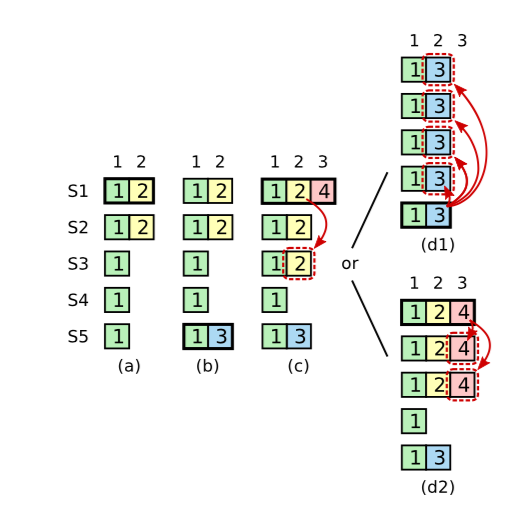

在raft的论文的6.3和6.4节描述了raft如何实现线性一致性语义。下面总结一下dragonboat的实现方式，供以后参考。

# 需要考虑的问题

* 客户端发起请求，如果请求在commited之后，apply之前，系统挂了，客户端没有收到响应，又重新发起了一笔同样的请求，会发生什么问题。
* 客户端可能向A节点发起了写请求，写成功了，然后突然A挂了，客户端又去B节点发起读请求，那么B节点能正确返回A节点写入的值吗？ 

# 理论

1. 在线性语义下，在调用和相应的整个过程中，只能让客户端的请求执行一次，所以，要为每个客户端建立一个session的概念。session维护了一个唯一的标识符用于标识客户端来源，同时要提供一个单调递增的数字用于标识当前客户端的第N此请求，如果session中已经处理了N请求，那么不会再影响N-1以前的请求。实现了指令去重的功能。（这里还有一个session失效的问题，后续再描述）

2.  针对第二个问题，其实只需要让读请求也走一遍raft日志，entry的命令里存储的就是get命令，那么肯定是可以保证线性一致性的。但是因为每次都会有一个log落盘的开销，对于大量的请求来说不太合适。所以论文提出了ReadIndex协议。描述如下：

   * 客户端发起一笔读请求（需要维护在session中，标识本次请求的标识符）
   * 因为接受客户端请求的节点，不一定是leader的，所以节点要判断自己是不是leader，如果不是leader，递转请求到leader。
   * leader节点把收到get请求消息的时候，记录下当前commited的index， 记录为ReadIndex。简单来说，就是要知道当前get请求到达的时候，raft组当前处理到了哪个地方。get请求要获取这个readIndex之后的数据
   * leader把这个readIndex返回给请求方节点
   * 请求方需要等到自己本地的apply index >=ReadIndex的时候，才可以返回给客户端。因为只有apply之后，这个节点的数据才能和leader的数据一致。 

   总结一下，大致原理，就是客户端请求的时候，leader已经执行到了N号日志，而其他服务节点，才执行到N-100，那么如果要从其他节点获取到get请求的一致的结果，那么必须得等到自己也到了N号的时候，数据才会一致。

# ReadIndex的具体细节

看似readIndex协议很简单，但是有很多需要注意的细节。

* 假设客户端的get请求，直接发到了leader节点，leader节点是不是可以直接把数据发给客户端？ 答案是不可以。因为假设ABCDE五个节点构成了一个raft组，其中AB在北京，CDE在武汉，当前A是leader，租期是10分钟。 在某个时候，北京和武汉的光纤被挖断了，那么AB和CDE出现了网络分区，CDE自己选了一个leader出来，然后开始处理请求，commitedIndex一直向前推动，但是A节点不这么认为，他还认为自己是leader，认为自己的数据一定是最新的，那么如果在这个时候A节点接受了客户端的请求，把A节点的数据返回给了客户端，那么客户端其实读取到的就是stale过期的数据。

  为了解决这个问题，首选要保证： **leader节点确实是真的leader。 只需要向所有的机器发送一个心跳，如果收到了大多数的回应，就能确定当前leader没有被分区，还是leader**。

* 如果leader刚刚当选，就收到了客户端的get请求，即便发送了心跳确定了leader的地位，那么是不是可以直接把数据返回给客户端呢？ 也不能。我们来分析这个情况。 

  

  看这种情况（黑色的框标识leader，方框里的字表示term，横向的方框下标表示索引），我们用一个**[T,I]**来表示当前Term为T，index为I的数据。

  * 在a阶段，S1是leader，在term为2的时候发起了index为2的日志，复制了1台之后S1挂了[2,2]
  * 在b阶段，S5接受了S3，S4的选票，当选为leader，当前term为3，他也写了一笔index为2的日志到自己的节点[3,2]
  * 在c阶段，S5挂了，他写的term3，index2的日志别人还不知道。S1又当选为leader，term为4

  

  好，现在开始分析这种情况，如果S1在c阶段，刚刚当选leader，此时，客户端发来了一个get请求，S1发送了一笔心跳之后，发现自己确实是leader。但是，**此时还不能直接返回数据**，因为假设把[2,2]的数据返回给了客户端，然后突然S1挂了，怎么办。这个时候S5可能会重现当选为leader（因为他的term最大），S5就会把[3,2]的数据复制到其他节点，覆盖了[2,2]。其他的读请求读取到的是[3,2]的数据，而刚才的客户端请求读取的是[2,2]的数据，就不会是线程一致的了。 

  针对上述情况，需要做一个保证：

  > leader在收到get请求的时候，第一步要做的就是： 检查当前leader的term下是不是已经commited过日志了。

  如果commited过了日志，那么即使S1挂了，S5也不会当选为leader，因为他的term是3，其他节点有记录为term4了。所以此时的S1的数据就是安全的，也就可以安全的返回给调用方了。

  这也就要求：

  > leader在当选之后，首先要确认leader的地位：即发送一条NO-OP的日志给其他节点，等收到大多数的回应之后，leader地位才会真正的确立。

* 如果每一个get请求，都要发送一个心跳，那么效率就会很低。所以可以做一个优化，在一个心跳周期内，持续累计ReadIndex请求，当心跳结束之后确定了leader的地址，就可以给N个ReadIndex请求返回数据了。

总结一下ReadIndex的步骤：

1. 如果leader在当前任期内没有commit过日志，就一直等到有日志提交之后，才能进行后续步骤
2. leader节点记录下当前请求进来时的commit index 做为ReadIndex
3. leader必须确保他的地位没有被压制，也就是要发送一个心跳，收到大多数的回应之后才能确定leader地位
4. leader等待他的状态机apply到ReadIndex之后，才能保证线性一致性
5. leader执行get请求，把数据返回给调用方

其中1，2，3步骤必须发生在leader节点，而4，5步骤可以发生在其他服务器节点。（状态机都执行到了readIndex的时候，数据是一致的）

# dragonboat实现代码

