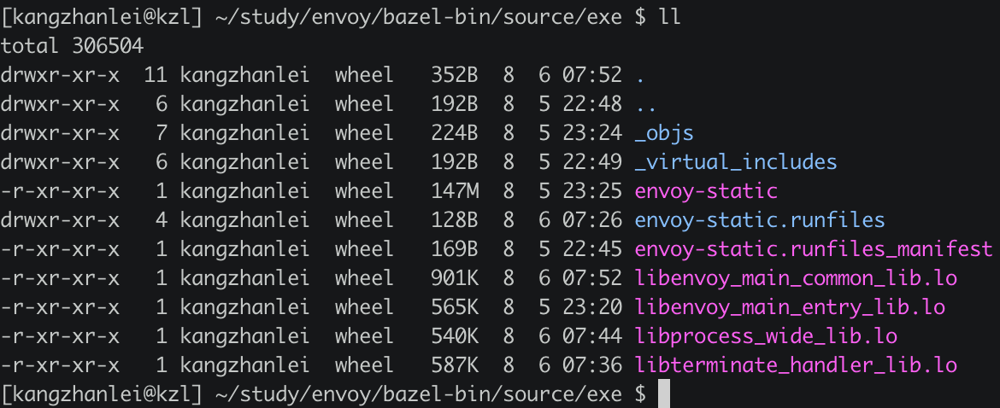
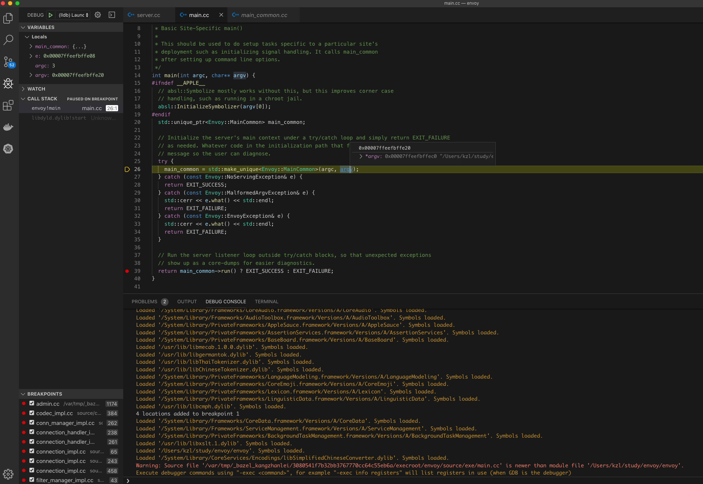
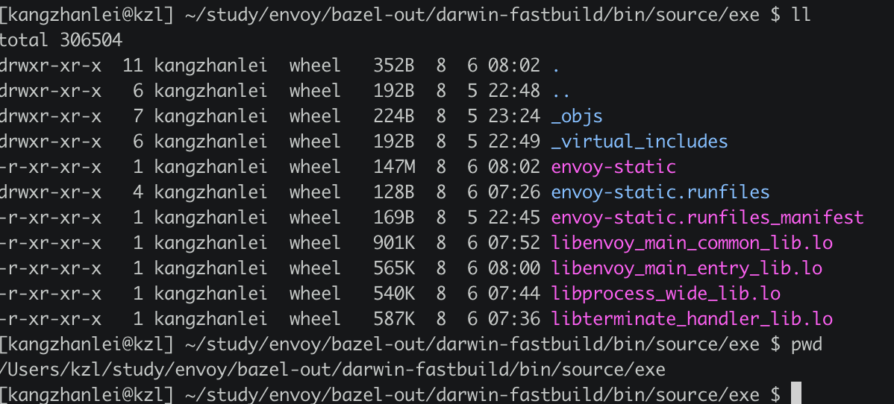
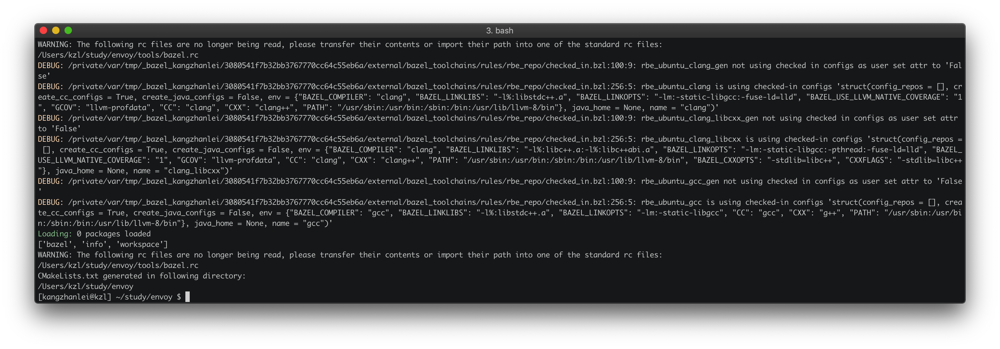
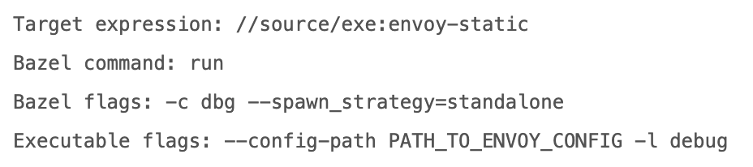
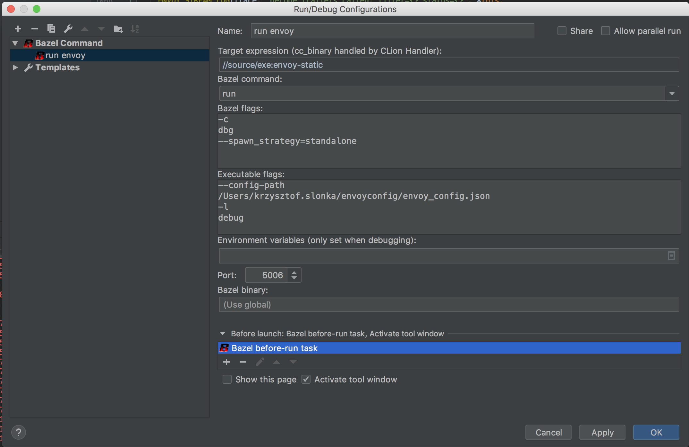
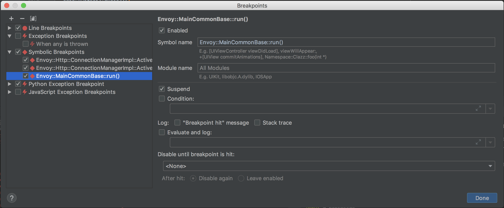
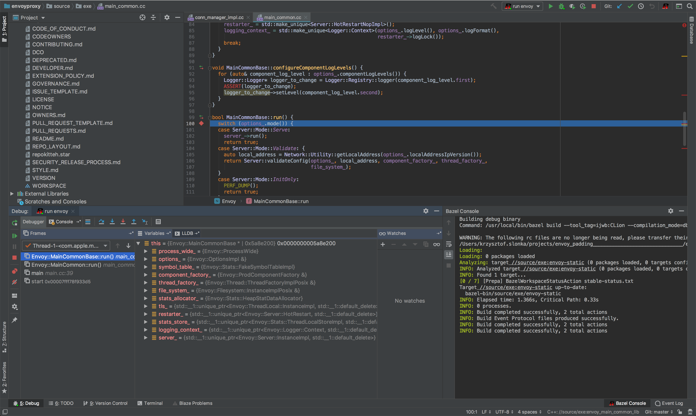

# Mac构建

在mac上直接使用bazel来构建envoy的源码。 本次使用最新的版本`v1.11.0`

* 下载源码  [envoy](https://github.com/envoyproxy/envoy.git) ，然后执行`git checkout -b v1.11.0` 切到指定的版本
* cd到源码目录， 执行`ci/mac_ci_setup.sh` 安装bazel等依赖
* 修改`ci/mac_ci_steps.sh`，给`BAZEL_BUILD_OPTIONS`增加两个配置`-c dbg --spawn_strategy=standalone `, 用来生成调试符号。 不然没有办法调试
* 执行`ci/mac_ci_steps.sh` 执行编译和测试。最终的文件生成在`envoy/bazel-bin/source/exe`下面



构建过程中需要梯子，需要自备。


# vscode打开工程

打开vscode，选择打开文件夹envoy， 然后点击F5，会产生一个launch.json , 填入一下内容：

```json
{
    // Use IntelliSense to learn about possible attributes.
    // Hover to view descriptions of existing attributes.
    // For more information, visit: https://go.microsoft.com/fwlink/?linkid=830387
    "version": "0.2.0",
    "configurations": [
        {
            "name": "(lldb) Launch",
            "type": "cppdbg",
            "request": "launch",
            "program": "${workspaceFolder}/envoy",
            "args": ["-c","myConfig/kzl.yaml"],
            "stopAtEntry": false,
            "cwd": "${workspaceFolder}",
            "environment": [],
            "externalConsole": false,
            "MIMode": "lldb"
        }
    ]
}
```

说明：

* program是运行时的文件， 为了简单，我把编译之后的envoy-static，复制到了工程目录下，方便运行
* args里面填的是envoy的启动参数， -c表示路径，这里配置的是envoy的bootstrap的配置文件
* 因为是在mac下，所以用的是lldb来调试。 linux下改为gdb即可


配置完成之后，点击`F5`开启调试




注意： **vscode里需要安装c++的插件。**


以下是clion相关部分，并没有实现成功。

# Clion打开工程

* 首先下载 [bazel-cmakelists](https://github.com/lizan/bazel-cmakelists), 复制到envoy源码目录
* 执行 `./bazel-cmakelists --targets //source/exe/...` 开始构建, 如果已经构建完成，不想重新构建，只是生成cmakelist的话，增加参数 `--skip_build` 
* 用Clion打开envoy项目文件





最终生成了`CMakeLists.txt文件，路径如下：



用CLion打开envoy文件夹， 选择执行的cmakelist即可完成环境搭建。

# clion 通过bazel打开项目

1. 打开clion

2. 安装bazel插件，在设置中，选择bazel的运行时文件，要指定绝对路径，不然报sync failed

3. 文件，导入bazel工程，选择envoy

4. 下一步选择envoy下的BUILD文件

5. 等待同步完成

6. 增加运行时配置

   

7. 

8. 设置调试信息

   

9. 开始调试

10. 设置断点

    

11.  选择上步生成的cmakelist.txt文件，右键，load cmake project， 可以在clion中进行符号跳转。
